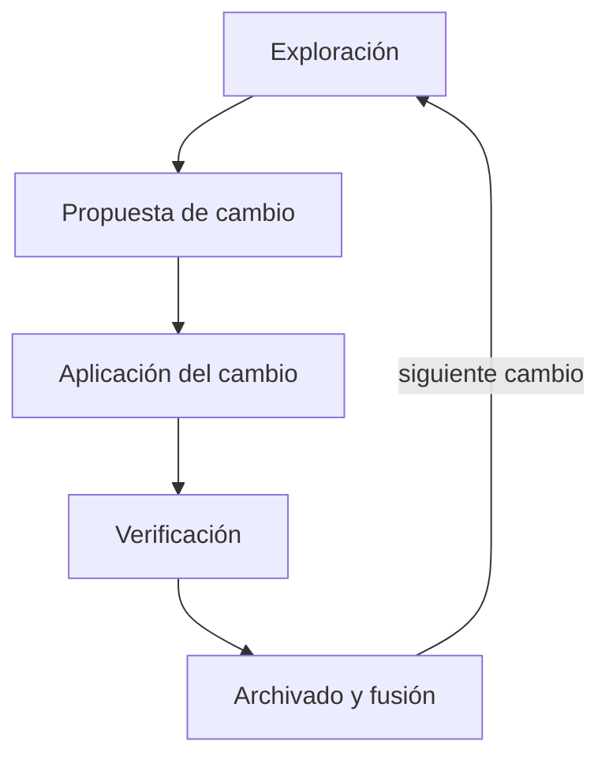
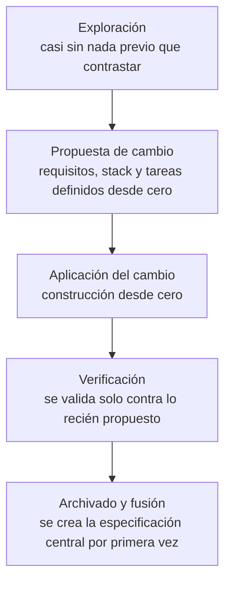
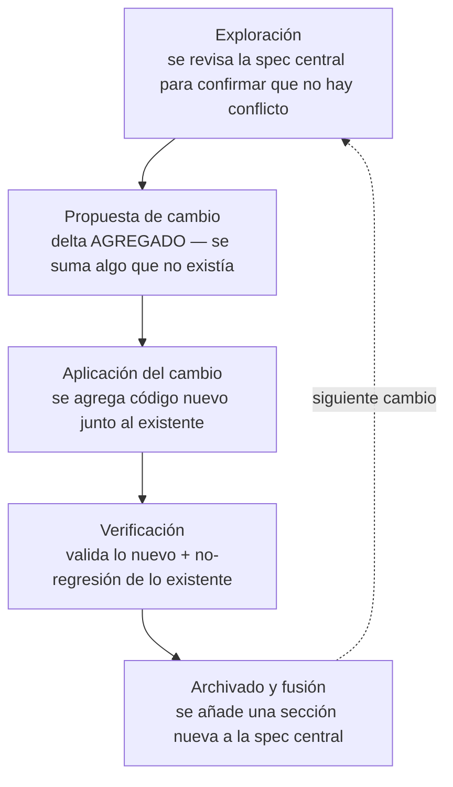
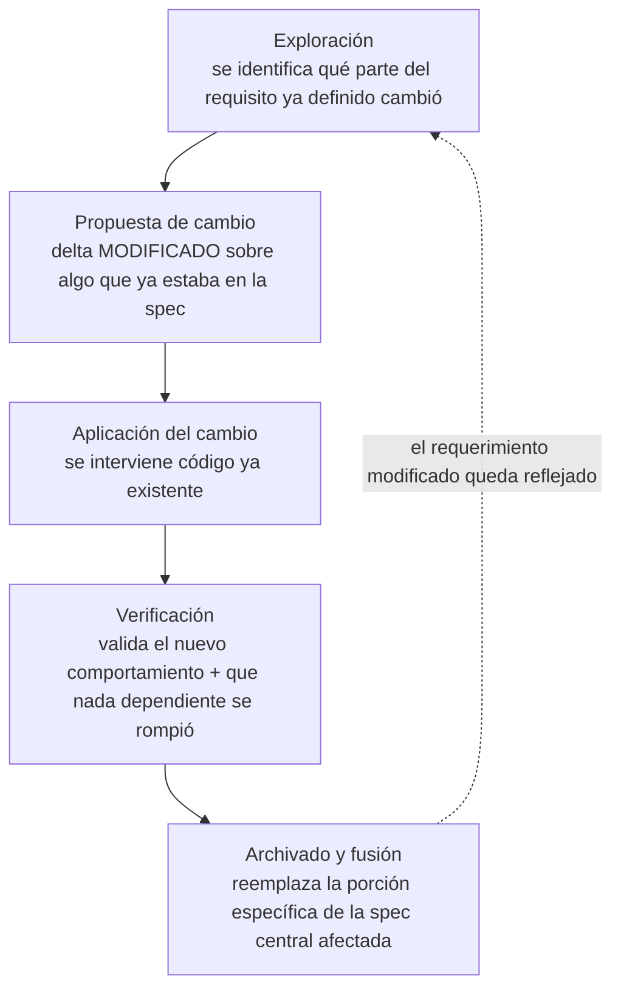
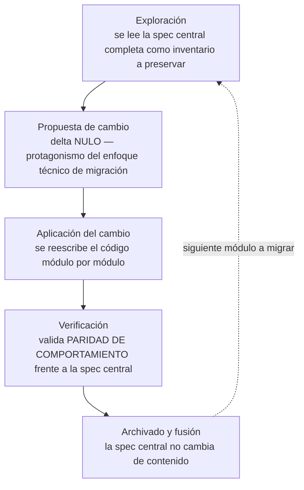
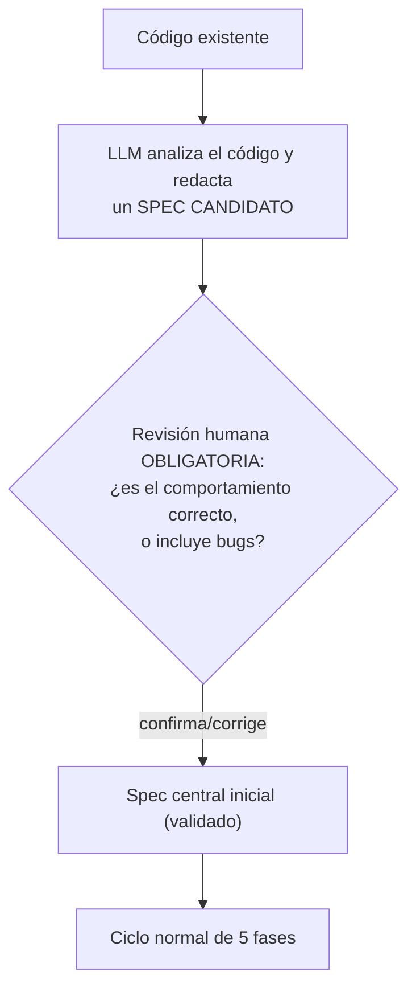

# Metodología de Desarrollo Asistido por IA (Spec-Driven Development — Enfoque Spec-Anchored)

---

## 1. Idea central

La especificación no se descarta después de construir algo: se mantiene como un documento **vivo**, actualizado cada vez que se completa un cambio. El trabajo se organiza en **cambios (changes)**: unidades acotadas, más pequeñas que una funcionalidad completa. Cada cambio recorre un ciclo de 5 fases y termina fusionándose a una **especificación central única** que siempre refleja el estado real del sistema.

No se separa el "qué" (requisitos) del "cómo" (stack, arquitectura, tareas) en fases distintas: ambos se definen juntos, dentro de la propuesta del cambio.

### Diagrama del ciclo

| Fase | Qué responde |
|---|---|
| Exploración *(opcional)* | ¿Vale la pena el cambio? ¿Cómo encaja con lo existente? |
| Propuesta de cambio | ¿Qué se cambia, por qué, cómo y en qué tareas? |
| Aplicación del cambio | Construcción efectiva |
| Verificación | ¿Lo construido coincide con lo propuesto? |
| Archivado y fusión | Se consolida el cambio en el sistema |

---

## 2. Los cinco escenarios de partida

Antes de ver cómo se comporta cada fase, conviene tener claro desde qué punto de partida se ejecuta el ciclo, porque eso determina cómo varía cada paso:

| Escenario | Punto de partida |
|---|---|
| **Caso 1 — Desde cero** | No hay sistema ni spec central |
| **Caso 2 — Funcionalidad nueva** | Ya existe sistema + spec central; se agrega algo que no existía |
| **Caso 3 — Modificación de requerimiento existente** | El requerimiento que cambia ya estaba definido en la spec |
| **Caso 4 — Migración de lenguaje** | Se reescribe en otro lenguaje/stack sin cambiar comportamiento |
| **Caso 5 — Código sin spec previo** | Hay código, pero nunca se documentó formalmente |

### Flujo por caso

**Caso 1 — Desde cero**

**Caso 2 — Funcionalidad nueva en un sistema ya existente**

**Caso 3 — Modificación de un requerimiento ya existente**

**Caso 4 — Migración de lenguaje**

### Caso 5 — Fase 0 (ingeniería inversa de especificación)

Cuando hay código pero no spec central, antes del ciclo normal se ejecuta, una sola vez:

La revisión humana aquí no es opcional: un spec inferido del código describe lo que el código *hace*, no lo que *debería* hacer. Sin esa revisión, un bug quedaría documentado como comportamiento válido. Una vez validado el spec inicial, los cambios posteriores se comportan como el Caso 2 o el Caso 3, según corresponda.

---

## 3. Los documentos: cuántos hay y dónde se tocan

Existen dos tipos de spec:

- **Spec central (1, único, persistente):** retrato vigente de todo el sistema.
- **Spec transitorio (1 por cambio):** existe solo mientras el cambio está en curso; al final se archiva.

| Fase | Documento | Qué pasa |
|---|---|---|
| Propuesta de cambio | Spec transitorio | Se **crea** |
| Aplicación del cambio | Spec transitorio | Se **ajusta**, si hace falta |
| Verificación | Spec transitorio | Se **valida** contra lo construido |
| Archivado y fusión | Spec central | Se **actualiza** — único momento en que cambia |

Nunca hay más de un spec central a la vez, aunque sí pueden coexistir varios specs transitorios en paralelo.

---

## 4. Trazabilidad: quién aporta qué en cada fase, y cómo varía según el escenario

| Fase | Input humano | Input heredado | Genera el LLM | Documento tocado | Cómo varía (Caso 1 / 2 / 3) | Cómo varía (Caso 4 / 5) |
|---|---|---|---|---|---|---|
| **Exploración** | Idea/necesidad inicial, contexto de negocio | Spec central vigente (si existe) | Resumen del problema + camino sugerido | Spec central: se **lee** | **C1:** no hay spec que leer. **C2:** se lee para confirmar que no hay conflicto. **C3:** se lee la porción puntual del requisito que cambió. | **C4:** se lee la spec central completa, como inventario de comportamiento a preservar. **C5:** no hay spec que leer todavía — primero debe ejecutarse la fase 0 (sección 2). |
| **Propuesta de cambio** | Instrucción en lenguaje natural, mockups (Figma), stack/arquitectura si se fija | Resumen de Exploración | Delta de requisitos + enfoque técnico + tareas → **spec transitorio** | Spec transitorio: **nace** | **C1:** delta = 100% del sistema (todo "agregado"). **C2:** delta solo "agregado". **C3:** delta "modificado"/"eliminado"; el enfoque técnico debe respetar stack/arquitectura ya definidos. | **C4:** delta **nulo** — el protagonismo pasa al enfoque técnico (lenguaje/framework destino, estrategia de migración). **C5:** una vez reconstruido el spec en la fase 0, se comporta como C2 o C3 según el cambio. |
| **Aplicación del cambio** | Aprobación opcional | Spec transitorio + tareas | Código construido; ajustes al spec transitorio si algo no encaja | Spec transitorio: se **actualiza** (si aplica) | **C1:** se construye sobre base vacía. **C2:** se agrega código nuevo junto al existente, sin tocarlo. **C3:** se modifica código ya existente — mayor probabilidad de ajustes al spec transitorio sobre la marcha. | **C4:** se reescribe el código módulo por módulo en el lenguaje destino, guiado por el comportamiento de la spec central (no por la sintaxis original). **C5:** no aplica hasta completar la fase 0; después, igual que C2/C3. |
| **Verificación** | Ninguno obligatorio | Sistema construido + spec transitorio | Reporte de coincidencia/discrepancias | Spec transitorio: se **compara**, no se toca | **C1:** valida solo lo nuevo. **C2:** + no-regresión de lo existente. **C3:** la más exigente — valida el nuevo comportamiento y el impacto en lo que dependía del anterior. | **C4:** valida **paridad de comportamiento** frente a la spec central — la fase con más peso de todos los casos. **C5:** igual que C2/C3, una vez reconstruido el spec. |
| **Archivado y fusión** | Confirmación opcional | Spec transitorio verificado + spec central | Fusión del delta hacia el spec central | Spec central: se **actualiza** · Spec transitorio: se **archiva** | **C1:** crea el spec central. **C2:** añade una sección nueva. **C3:** reemplaza la porción específica ya existente. | **C4:** no cambia el contenido de comportamiento; a lo sumo actualiza referencias técnicas no funcionales. **C5:** no aplica en la fase 0 (ahí se **crea** el spec inicial tras validación humana); en cambios posteriores, igual que C2/C3. |

**El delta** (agregado / modificado / eliminado) nace en Propuesta de cambio y viaja sin alterarse hasta Archivado y fusión.

**Regla general:** intención, criterio de negocio y decisiones visuales = input humano. Redacción, código, comparación y fusión = generado por el LLM. Todo lo que no es aportado por la persona en esa fase puntual es output heredado de la fase anterior.

---

## 5. Pendiente por definir: arquitectura y decisiones estructurales

Decisiones como el patrón arquitectónico (p. ej. microservicios), los límites de cada servicio, y cómo se comunican entre sí, **no encajan bien como delta de comportamiento** en el spec central ni deberían quedar enterradas dentro de la propuesta de un solo cambio. Se identificó la necesidad de un **tercer documento persistente** (arquitectura y convenciones del proyecto), separado del spec central, que:

- Se define una vez, típicamente en el primer cambio de un Caso 1.
- Se **lee** como contexto obligatorio en la Propuesta de cambio de cualquier cambio futuro.
- Solo se actualiza mediante un cambio dedicado a arquitectura, no como parte de un cambio funcional.

---

## 6. Casos de uso por escenario

Se usa el mismo sistema (gestión de pedidos) como hilo conductor para los 5 casos.

### Caso 1 — Desde cero
**Contexto:** no existe nada aún; se va a construir el sistema de pedidos por primera vez.
- **Exploración:** no hay spec central que consultar; solo la idea inicial ("necesitamos gestionar pedidos").
- **Propuesta de cambio:** instrucción en lenguaje natural describiendo el sistema completo (crear pedido, ver historial, cambiar estado) + stack elegido (ej. Node + React) → delta = 100% del sistema.
- **Aplicación:** se construye todo desde cero.
- **Verificación:** se valida que el sistema cumple lo especificado (no hay nada previo que pueda romperse).
- **Archivado y fusión:** se crea el spec central por primera vez.

### Caso 2 — Funcionalidad nueva en un sistema ya existente
**Contexto:** el sistema ya permite ver el historial de pedidos en una lista simple; se agrega la capacidad de **filtrar por estado** (pendiente, enviado, entregado, cancelado).
- **Exploración:** se confirma que el historial no tiene filtros y que agregar uno no choca con nada.
- **Propuesta de cambio:** instrucción en lenguaje natural + mockup de Figma → delta "agregado" (filtro por estado), enfoque técnico (reutilizar componente existente, filtrado en cliente), tareas.
- **Aplicación:** se construye el filtro sobre el código existente, siguiendo el mockup.
- **Verificación:** el filtro funciona para los 4 estados, coincide con el mockup, y la lista sin filtro sigue funcionando.
- **Archivado y fusión:** el spec central se actualiza — el historial ahora incluye filtrado por estado.

### Caso 3 — Modificación de un requerimiento ya existente
**Contexto:** ya implementado el filtro (Caso 2), a mitad del siguiente sprint el equipo descubre que el filtrado en el cliente no escala con el volumen real de pedidos y decide que **debe resolverse en el servidor**.
- **Exploración:** se ubica en la spec central la sección que ya describía el filtro y su enfoque técnico actual (filtrado en cliente).
- **Propuesta de cambio:** delta "modificado" — el comportamiento visible no cambia, pero el enfoque técnico sí: ahora el filtro consulta al servidor.
- **Aplicación:** se modifica el código existente del filtro, reemplazando la lógica de cliente por una llamada al servidor.
- **Verificación:** se valida que el filtro sigue funcionando igual para el usuario, y que nada que dependía del filtrado en cliente se rompió.
- **Archivado y fusión:** se reemplaza la porción de la spec central que describía el enfoque técnico anterior del filtro.

### Caso 4 — Migración de lenguaje
**Contexto:** el sistema de pedidos, ya maduro, se va a reescribir de Node.js a Go, sin cambiar su comportamiento.
- **Exploración:** se lee la spec central completa como inventario de todo lo que el sistema debe seguir haciendo.
- **Propuesta de cambio:** no hay delta de requisitos; se define la estrategia de migración (módulo por módulo, empezando por el historial de pedidos) y las equivalencias de librerías entre Node y Go.
- **Aplicación:** se reescribe el módulo del historial (incluyendo el filtro) en Go, guiándose por el comportamiento descrito en la spec, no por el código Node original.
- **Verificación:** se valida paridad de comportamiento — el historial y el filtro en Go se comportan exactamente igual que en Node.
- **Archivado y fusión:** el contenido de comportamiento de la spec central no cambia.

### Caso 5 — Código sin spec central previo
**Contexto:** se hereda el sistema de pedidos, construido hace tiempo sin ninguna documentación formal, y se quiere empezar a aplicar esta metodología desde ahora.
- **Fase 0:** el LLM analiza todo el código existente (creación de pedidos, historial, filtro, etc.) y redacta un spec candidato describiendo el comportamiento observado.
- **Revisión humana:** el equipo revisa el spec candidato y detecta que el filtro, tal como está documentado por el LLM, en realidad tiene un bug (no filtra pedidos cancelados correctamente) — se corrige esa parte antes de aceptar el spec.
- **Spec central inicial:** queda validado y publicado, ya sin ese error documentado como "comportamiento oficial".
- **De ahí en adelante:** cualquier cambio nuevo sobre este sistema (agregar algo, modificar algo) sigue el Caso 2 o el Caso 3 según corresponda.
