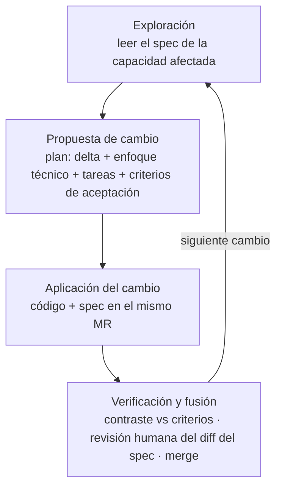
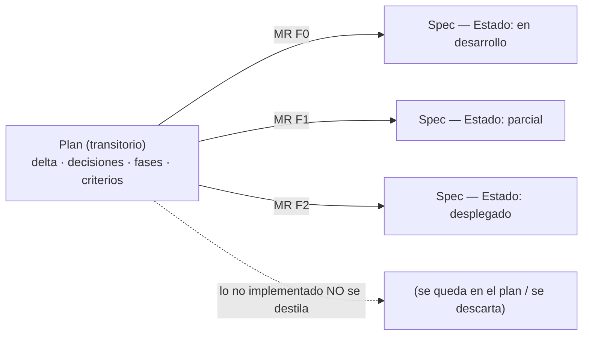
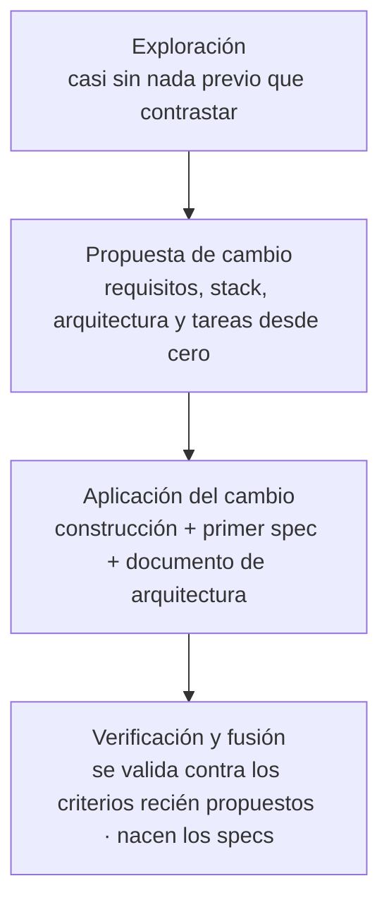
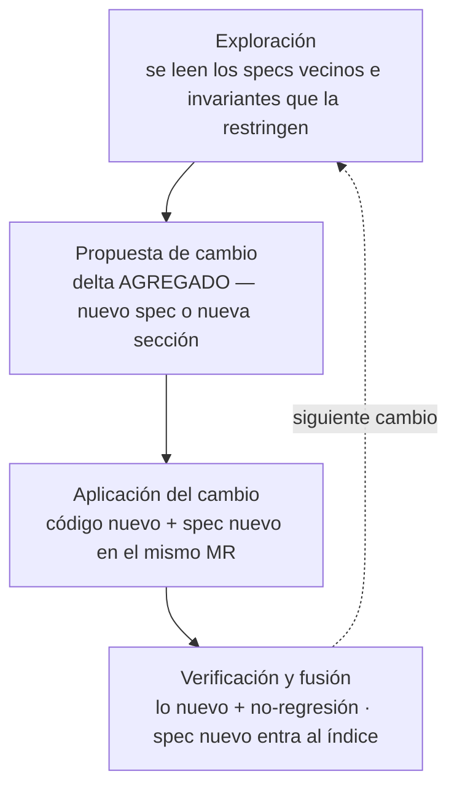
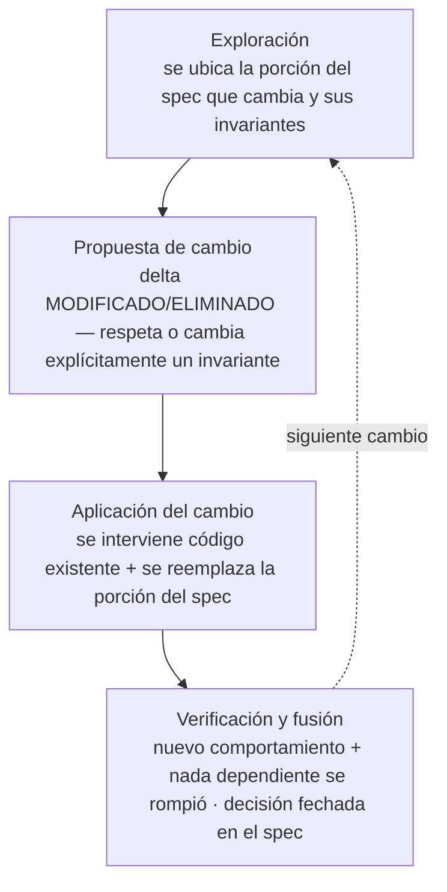
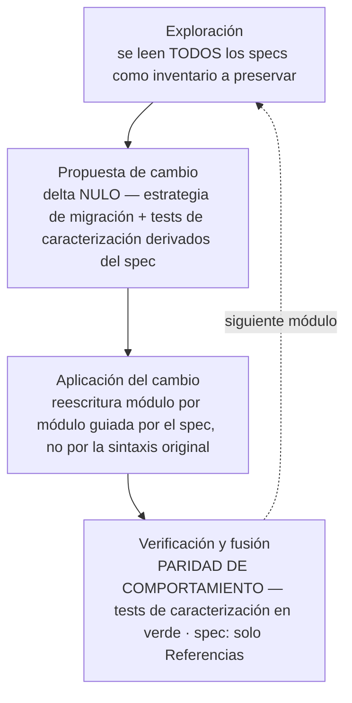
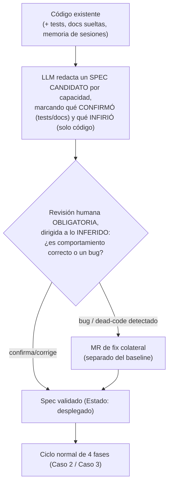
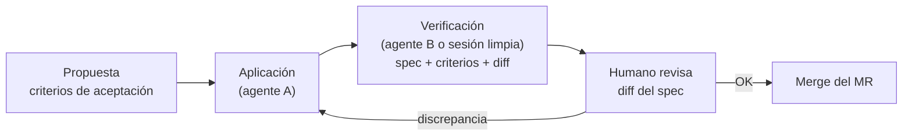

# Metodología de Desarrollo Asistido por IA (Spec-Driven Development — Enfoque Spec-Anchored)

**Versión 2** · 2026-09-07 · Cambios respecto a v1: specs por capacidad (no un spec único), plan vs spec, fusión anclada al merge del MR, verificación con gate humano mínimo, formato fijo del spec, documento de arquitectura resuelto, reglas operativas (qué no es cambio de comportamiento, tamaño del cambio, "specs primero"), Fase 0 ampliada con lecciones reales.

---

## 1. Idea central

La especificación no se descarta después de construir algo: se mantiene como documentación **viva**, actualizada en el mismo cambio que modifica el comportamiento. El trabajo se organiza en **cambios (changes)**: unidades acotadas, más pequeñas que una funcionalidad completa, que caben en un Merge Request de vida corta. Cada cambio recorre un ciclo de 4 fases y termina fusionándose, junto con su código, al **conjunto canónico de specs** que siempre refleja el estado real del sistema.

No se separa el "qué" (requisitos) del "cómo" (stack, arquitectura, tareas) en fases distintas: ambos se definen juntos, dentro de la propuesta del cambio.

**La regla de anclaje:** *el MR que cambia comportamiento toca su spec en el mismo commit.* El spec no se actualiza "después"; se actualiza como parte del cambio, y el gate que lo garantiza es el merge del MR.

### Diagrama del ciclo



| Fase | Qué responde | Gate |
|---|---|---|
| Exploración *(opcional, pero obligatoria si existe spec de la capacidad)* | ¿Vale la pena el cambio? ¿Cómo encaja con lo existente? ¿Qué invariantes lo restringen? | — |
| Propuesta de cambio | ¿Qué se cambia, por qué, cómo, en qué tareas y cómo sabremos que quedó bien? | Aprobación humana del plan (implícita si el cambio es chico) |
| Aplicación del cambio | Construcción efectiva + actualización del spec | Build/lint/tests en verde |
| Verificación y fusión | ¿Lo construido coincide con lo propuesto? ¿El spec describe lo que corre? | Revisión humana del diff del spec + merge del MR |

> En v1 "Verificación" y "Archivado y fusión" eran fases separadas. Se fusionan porque un paso posterior al merge que actualice la spec es exactamente el paso que se olvida. La fusión ocurre **al mergear**, no en una tarea humana aparte.

---

## 2. Los documentos: cuáles hay y quién manda

| Documento | Cantidad | Vida | Qué contiene |
|---|---|---|---|
| **Spec** (`docs/specs/spec-<capacidad>.md`) | Uno **por capacidad** del sistema | Persistente | Comportamiento **AS-BUILT** (lo que corre), invariantes con su porqué, decisiones fechadas, fuera de alcance, referencias |
| **Índice de specs** (`docs/specs/README.md`) | 1 | Persistente | Convención + tabla capacidad → spec |
| **Plan** (`docs/plan-<tema>-<fecha>.md`) | Uno por cambio (o por familia de cambios en fases) | Transitorio | Propuesta: contexto, delta, decisiones tomadas, enfoque técnico, fases/tareas, criterios de aceptación, pendientes de decisión |
| **Documento de arquitectura y convenciones** (`CLAUDE.md` raíz + uno por subproyecto) | 1 por proyecto/subproyecto | Persistente | Patrón arquitectónico, límites entre servicios, invariantes transversales (concurrencia, seguridad, portabilidad), restricciones del entorno, comandos |

**Precedencia cuando dos documentos difieren:** `spec` > documento de arquitectura > memoria de sesión, apuntes o docs históricos. Lo que no es spec es índice, caché o plan.

### Por qué specs por capacidad y no un "spec central único"

Un solo documento central no escala: todo cambio tocaría el mismo archivo (conflictos entre cambios paralelos), y el LLM tendría que cargar el sistema entero para cualquier tarea. Con un spec por capacidad, la regla equivalente es: **cada comportamiento vive en exactamente un spec**. Las capacidades cruzan subproyectos (back + front + ci) y el spec las describe completas, no por repo ni por MR.

### Plan vs spec

El plan es la "spec transitoria" de v1, con nombre propio. Diferencias que importan:

- El plan puede contener alternativas descartadas, dudas, fases futuras y pendientes de decisión. El spec **no**: describe solo lo que corre.
- El plan **no se archiva: se destila**. Cuando una fase se implementa, lo que quedó construido pasa al spec (comportamiento a *Comportamiento*, decisiones a *Decisiones* con fecha, lo excluido a *Fuera de alcance*). Lo que no se implementó no entra al spec.
- Un plan con fases (F0, F1, F2…) alimenta el spec en varios MRs; el spec nace en el MR de la primera fase con `Estado: en desarrollo` y pasa a `parcial` / `desplegado` a medida que las fases entran.



### Formato fijo del spec

```markdown
# Spec: <nombre de la capacidad>

**Estado:** desplegado | parcial | en desarrollo · **Última revisión:** YYYY-MM-DD

## Propósito
## Comportamiento
## Invariantes (no negociables)   ← cada uno con su porqué
## Decisiones                     ← "- YYYY-MM-DD: decisión — porqué"
## Fuera de alcance
## Referencias                    ← código, migraciones, endpoints, docs
```

Las dos secciones que más valor aportan al trabajo con LLM son **Invariantes con su porqué** y **Decisiones fechadas**: son lo que evita que una sesión futura "optimice" algo que fue una decisión deliberada (p. ej. un `Promise.allSettled` que parece reemplazable por `Promise.all`, o un merge que parece mejorable con rebase). Un invariante sin porqué es una regla que el siguiente agente va a cuestionar.

**Qué NO va en un spec:** checklists paso a paso (van en scripts y sus docs), estados transitorios ("pendiente de deploy"), y detalles que el código expresa mejor (firmas, tipos): se referencian, no se duplican.

---

## 3. Reglas operativas

**3.1 Specs primero.** Al iniciar cualquier cambio, el LLM lee el spec de la capacidad afectada **antes** de proponer. Esta instrucción vive en el documento de arquitectura (`CLAUDE.md`) para que se aplique en cada sesión sin depender de que alguien lo recuerde.

**3.2 Qué es y qué no es un cambio de comportamiento.** Solo los cambios de comportamiento obligan a tocar el spec:

| Toca spec | No toca spec (o solo *Decisiones*/*Referencias*) |
|---|---|
| Nueva capacidad o subcapacidad | Refactor interno sin efecto observable |
| Cambio en lo que el usuario/sistema observa (UI, API, votos, mensajes, tiempos) | Estilos, textos sin cambio semántico |
| Nuevo invariante o decisión que restringe cambios futuros | Actualización de dependencias sin cambio de comportamiento |
| Eliminación de una capacidad | Cambio de implementación con el mismo comportamiento (→ solo *Decisiones* + *Referencias*) |

**3.3 Tamaño del cambio.** Un cambio = un MR de vida corta (días, no semanas) que deja `main` desplegable. Un requerimiento grande se parte en fases con un plan padre; cada fase es un cambio con su propio MR. Si una fase toca un punto sensible (p. ej. algo que puede alterar un veredicto automático), va en MR separado y, si aplica, con un modo *dry-run* antes de activarse.

**3.4 Criterios de aceptación antes de construir.** La propuesta incluye cómo se verificará el cambio (casos concretos, no "funciona bien"). Se escriben antes del código para que la verificación no la defina quien construyó.

**3.5 Enforcement.** Por convención mientras el equipo sea de 1-3 personas. Si crece: checklist en el template de MR ("¿este MR cambia comportamiento? → ¿tocó su spec?") y, opcionalmente, un check de CI que exija cambios en `docs/specs/` cuando el diff toca código de una capacidad con spec.

---

## 4. Los cinco escenarios de partida

| Escenario | Punto de partida |
|---|---|
| **Caso 1 — Desde cero** | No hay sistema ni specs |
| **Caso 2 — Funcionalidad nueva** | Ya existe sistema + specs; se agrega algo que no existía |
| **Caso 3 — Modificación de requerimiento existente** | El comportamiento que cambia ya está en un spec |
| **Caso 4 — Migración de lenguaje** | Se reescribe en otro lenguaje/stack sin cambiar comportamiento |
| **Caso 5 — Código sin spec previo** | Hay código, pero nunca se documentó formalmente |

### Flujo por caso

**Caso 1 — Desde cero**


**Caso 2 — Funcionalidad nueva en un sistema ya existente**


**Caso 3 — Modificación de un requerimiento ya existente**


**Caso 4 — Migración de lenguaje**


### Caso 5 — Fase 0 (ingeniería inversa de especificación)

Cuando hay código pero no specs, antes del ciclo normal se ejecuta, una sola vez, **por capacidad e incremental** (no "todo el sistema de una vez"):



La revisión humana aquí no es opcional: un spec inferido del código describe lo que el código *hace*, no lo que *debería* hacer. Sin esa revisión, un bug quedaría documentado como comportamiento válido.

Lecciones de aplicarlo en un sistema real (baseline de 9 specs, 2026-08-31):

- **La ingeniería inversa encuentra bugs y código muerto.** Salieron un fix de hallazgos colaterales y la eliminación de un servicio sin consumidores. Esos arreglos van en MRs separados del baseline para que el diff del spec sea revisable.
- **Incremental por capacidad** funciona; "todo el spec de una vez" no es revisable por un humano.
- **Marcar inferido vs confirmado** en el candidato dirige la revisión a donde está el riesgo.
- Lo que había en memorias de sesión, apuntes y CLAUDE.md pasa a ser **caché** del spec: se conserva como índice, pero deja de mandar.

---

## 5. Trazabilidad: quién aporta qué en cada fase, y cómo varía según el escenario

| Fase | Input humano | Input heredado | Genera el LLM | Documento tocado | Cómo varía (Caso 1 / 2 / 3) | Cómo varía (Caso 4 / 5) |
|---|---|---|---|---|---|---|
| **Exploración** | Idea/necesidad inicial, contexto de negocio | Spec de la capacidad + doc de arquitectura | Resumen del problema + camino sugerido + invariantes que lo restringen | Spec y doc de arquitectura: se **leen** | **C1:** no hay spec que leer. **C2:** se leen los specs vecinos para confirmar que no hay conflicto. **C3:** se lee la porción puntual que cambia. | **C4:** se leen todos los specs como inventario a preservar. **C5:** no hay spec todavía — primero la Fase 0 (sección 4). |
| **Propuesta de cambio** | Instrucción en lenguaje natural, mockups, stack si se fija, **respuestas a las decisiones abiertas** | Resumen de Exploración | Plan: delta + enfoque técnico + tareas/fases + **criterios de aceptación** + pendientes de decisión | Plan: **nace** | **C1:** delta = 100% del sistema. **C2:** delta solo "agregado". **C3:** delta "modificado"/"eliminado"; debe declarar si toca un invariante. | **C4:** delta **nulo** — protagonismo del enfoque técnico y de los tests de caracterización. **C5:** tras la Fase 0, se comporta como C2 o C3. |
| **Aplicación del cambio** | Aprobación del plan (explícita si el cambio es grande o toca invariantes) | Plan | Código + **spec actualizado en el mismo MR**; ajustes al plan si algo no encaja | Spec: se **crea/actualiza** · Plan: se **ajusta** si aplica | **C1:** base vacía; nacen specs + doc de arquitectura. **C2:** código nuevo + spec nuevo/sección nueva. **C3:** código existente + porción del spec reemplazada + decisión fechada. | **C4:** reescritura módulo por módulo guiada por el spec; spec solo cambia *Referencias*. **C5:** no aplica hasta completar la Fase 0. |
| **Verificación y fusión** | **Revisión del diff del spec** (mínimo) · merge del MR | Sistema construido + plan (criterios de aceptación) + spec | Reporte de coincidencia/discrepancias contra los criterios | Spec: se **compara** con lo construido · Plan: se marca **destilado** | **C1:** valida solo lo nuevo. **C2:** + no-regresión. **C3:** la más exigente — nuevo comportamiento + impacto en lo dependiente. | **C4:** paridad de comportamiento — tests de caracterización, no solo lectura. **C5:** en la Fase 0 la revisión humana es obligatoria y completa (no solo del diff). |

**El delta** (agregado / modificado / eliminado) nace en Propuesta de cambio y viaja sin alterarse hasta la fusión.

**Regla general:** intención, criterio de negocio, decisiones visuales y **resolución de decisiones abiertas** = input humano. Redacción, código, comparación y destilado = generado por el LLM.

### Por qué la verificación necesita un humano mínimo

En v1 el input humano de Verificación era "ninguno obligatorio". Eso deja al mismo agente que construyó verificando contra una spec que él mismo redactó: el punto ciego se verifica a sí mismo. Mitigaciones realistas para un equipo chico, de menor a mayor costo:

1. **Criterios de aceptación escritos antes de construir** (regla 3.4).
2. **Revisión humana del diff del spec**, no de todo el código. Si el spec cambió de forma inesperada, algo en el código también.
3. **Verificación con contexto limpio**: otra sesión u otro agente que solo recibe spec + criterios + diff, sin el historial de la construcción.



---

## 6. Arquitectura y decisiones estructurales

Decisiones como el patrón arquitectónico, los límites de cada servicio y cómo se comunican **no son delta de comportamiento** y no deben quedar enterradas en el plan de un solo cambio. Se resuelven con el **documento de arquitectura y convenciones** (sección 2): en este proyecto, `CLAUDE.md` en la raíz más uno por subproyecto.

- Se define en el primer cambio de un Caso 1 (o en la Fase 0 de un Caso 5).
- Se **lee** como contexto obligatorio en la Exploración/Propuesta de cualquier cambio.
- Solo se actualiza mediante un cambio dedicado a arquitectura, no como efecto lateral de un cambio funcional.
- Los invariantes transversales (concurrencia, seguridad, portabilidad del entorno) viven ahí; los invariantes de **una** capacidad viven en su spec.

---

## 7. Casos de uso por escenario

Se usa el mismo sistema (gestión de pedidos) como hilo conductor para los 5 casos.

### Caso 1 — Desde cero
**Contexto:** no existe nada aún; se va a construir el sistema de pedidos por primera vez.
- **Exploración:** no hay spec que consultar; solo la idea inicial ("necesitamos gestionar pedidos").
- **Propuesta de cambio:** instrucción en lenguaje natural describiendo el sistema completo (crear pedido, ver historial, cambiar estado) + stack elegido (ej. Node + React) + criterios de aceptación por capacidad → delta = 100% del sistema.
- **Aplicación:** se construye todo; nacen `spec-pedidos.md`, `spec-historial.md` y el documento de arquitectura.
- **Verificación y fusión:** se valida contra los criterios propuestos (no hay nada previo que pueda romperse); se crea el índice de specs.

### Caso 2 — Funcionalidad nueva en un sistema ya existente
**Contexto:** el sistema ya permite ver el historial de pedidos en una lista simple; se agrega la capacidad de **filtrar por estado** (pendiente, enviado, entregado, cancelado).
- **Exploración:** se lee `spec-historial.md`; se confirma que no tiene filtros y que agregar uno no choca con ningún invariante.
- **Propuesta de cambio:** instrucción en lenguaje natural + mockup → delta "agregado" (filtro por estado), enfoque técnico (reutilizar componente existente, filtrado en cliente), tareas, criterios ("los 4 estados filtran; sin filtro la lista es idéntica a la actual").
- **Aplicación:** se construye el filtro y, en el mismo MR, se agrega la sección "Filtrado por estado" a `spec-historial.md`.
- **Verificación y fusión:** el filtro cumple los criterios; el humano revisa el diff del spec; merge.

### Caso 3 — Modificación de un requerimiento ya existente
**Contexto:** ya implementado el filtro (Caso 2), el equipo descubre que el filtrado en cliente no escala y decide que **debe resolverse en el servidor**.
- **Exploración:** se ubica en `spec-historial.md` la sección del filtro y su decisión "filtrado en cliente".
- **Propuesta de cambio:** el comportamiento observable **no cambia**; cambia la implementación. Según la regla 3.2, el spec solo se toca en *Decisiones* ("2026-XX-XX: filtro pasa a servidor — el cliente no escala con N pedidos") y *Referencias* (nuevo endpoint). Criterio: paridad con el filtro actual + tiempo de respuesta bajo umbral.
- **Aplicación:** se reemplaza la lógica de cliente por la llamada al servidor; se actualizan *Decisiones* y *Referencias* en el mismo MR.
- **Verificación y fusión:** paridad para los 4 estados + nada que dependía del filtrado en cliente se rompió; merge.

> Este caso ilustra la distinción de la regla 3.2: si el *Comportamiento* del spec hubiera cambiado (p. ej. el filtro ahora es multi-estado), sería un delta "modificado" pleno.

### Caso 4 — Migración de lenguaje
**Contexto:** el sistema de pedidos, ya maduro, se va a reescribir de Node.js a Go, sin cambiar su comportamiento.
- **Exploración:** se leen todos los specs como inventario de lo que el sistema debe seguir haciendo.
- **Propuesta de cambio:** delta nulo; se define la estrategia (módulo por módulo, empezando por historial), equivalencias de librerías y **tests de caracterización** derivados de cada spec, que corren contra ambas implementaciones.
- **Aplicación:** se reescribe el módulo del historial (incluido el filtro) en Go, guiado por el spec, no por el código Node.
- **Verificación y fusión:** los tests de caracterización pasan en Go igual que en Node; el spec solo actualiza *Referencias* (rutas, endpoints) y una *Decisión* fechada de migración.

### Caso 5 — Código sin spec previo
**Contexto:** se hereda el sistema de pedidos, construido hace tiempo sin documentación formal, y se quiere aplicar la metodología desde ahora.
- **Fase 0, por capacidad:** el LLM analiza el código del historial y redacta `spec-historial.md` candidato, marcando "confirmado por test" vs "inferido del código".
- **Revisión humana:** el equipo revisa lo inferido y detecta que el filtro, tal como está documentado, en realidad tiene un bug (no filtra cancelados correctamente). Se corrige el spec para describir el comportamiento correcto y el bug se arregla en un MR separado.
- **Spec inicial:** queda validado y publicado con `Estado: desplegado`; los apuntes previos pasan a ser caché.
- **De ahí en adelante:** cualquier cambio sobre el historial sigue el Caso 2 o el Caso 3. Las demás capacidades pasan por la Fase 0 a medida que se tocan o en un baseline dedicado.
